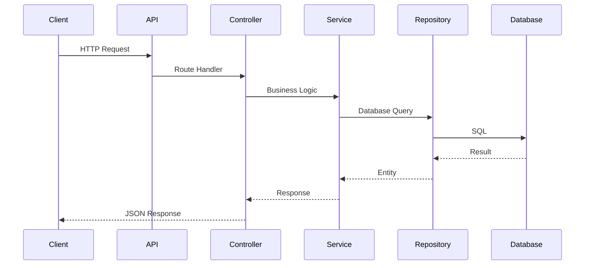

# Architecture

This project follows Layered Architecture.

```
Client
    │
    ▼
Express Router
    │
    ▼
Controller
    │
    ▼
Service
    │
    ▼
Repository
    │
    ▼
PostgreSQL
```

---

## Responsibilities

### Controller

- Handle HTTP Request
- Call Service
- Return Response

---

### Service

Contains business logic.

Examples

- Authentication
- Ownership checks
- Duplicate validation
- Role hierarchy

---

### Repository

Contains SQL queries only.

No business logic.

---

### Middleware

Cross-cutting concerns.

- Authentication
- Authorization
- Validation
- Error Handling

---

### Schema

Validates incoming requests using Zod.

```
Client

↓

Schema

↓

Controller
```

## Request Lifecycle


