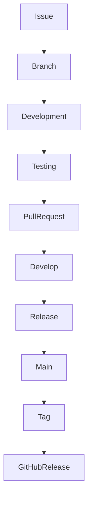

# Contributing

Thank you for your interest in contributing to **Expense Tracker Backend**.

Whether you're fixing a bug, improving documentation, adding a feature, or suggesting an enhancement, your contribution is appreciated.

Please read this guide before opening an issue or submitting a pull request.

---

# Development Workflow

The project follows a structured engineering workflow.



Every change should begin with a GitHub Issue and be completed through a Pull Request.

---

# Repository Branches

| Branch       | Purpose                    |
| ------------ | -------------------------- |
| `main`       | Stable production releases |
| `develop`    | Active development         |
| `feature/*`  | New features               |
| `fix/*`      | Bug fixes                  |
| `refactor/*` | Code improvements          |
| `docs/*`     | Documentation              |
| `chore/*`    | Maintenance tasks          |

Never commit directly to the `main` branch.

---

# Development Setup

## Clone the repository

```bash
git clone https://github.com/MishraRoushankumar/expenseTracker-Backend.git
cd expenseTracker-Backend
```

## Install dependencies

```bash
npm install
```

## Configure environment variables

```bash
cp .env.example .env
```

Update the environment variables according to your local setup.

---

# Branch Naming Convention

Use descriptive branch names.

Examples:

```text
feature/dashboard-analytics

feature/budget-management

fix/login-validation

refactor/transaction-service

docs/readme-refresh

chore/github-labels
```

---

# Commit Convention

This project follows the **Conventional Commits** specification.

Examples:

```text
feat(auth): implement refresh token support

fix(categories): validate category ownership

docs(readme): refresh project overview

refactor(logger): simplify logger configuration

test(auth): add authentication tests

chore(ci): update GitHub Actions workflow
```

Each commit should represent a single logical change.

---

# Pull Request Process

Before opening a Pull Request:

1. Ensure your branch is up to date with `develop`.
2. Verify all quality checks pass.
3. Update documentation if necessary.
4. Update the changelog when applicable.
5. Link the related GitHub Issue.

Example:

```text
Closes #42
```

Issue Pull Requests are merged into **develop** using **Squash and Merge**.

Release Pull Requests merge **develop** into **main** using a **Merge Commit**.

---

# Quality Checklist

Before submitting a Pull Request, run:

```bash
npm run lint

npm run typecheck

npm test

npm run build
```

All commands should complete successfully.

---

# Coding Standards

General guidelines:

- Write readable and maintainable code.
- Prefer small, focused functions.
- Follow the existing project structure.
- Avoid code duplication.
- Use TypeScript types instead of `any`.
- Validate external input using Zod.
- Handle errors consistently.
- Keep business logic inside services.
- Keep controllers lightweight.
- Use parameterized database queries.

---

# Documentation

Update documentation whenever your changes affect:

- API behavior
- Environment variables
- Development workflow
- Deployment process
- Database schema

Relevant documents include:

- README.md
- CHANGELOG.md
- SECURITY.md
- ARCHITECTURE.md
- docs/

---

# Reporting Issues

When creating an issue, provide:

- Clear description
- Steps to reproduce
- Expected behavior
- Actual behavior
- Environment information
- Screenshots (if applicable)

Use the appropriate GitHub Issue Template whenever possible.

---

# Code Review

Pull requests are reviewed for:

- Correctness
- Maintainability
- Readability
- Performance
- Security
- Consistency
- Testability

Constructive feedback is encouraged and appreciated.

---

# Security

If you discover a security vulnerability, **do not create a public issue**.

Please follow the responsible disclosure process described in **SECURITY.md**.

---

# Questions

If you have questions about the project, start by reviewing:

- README.md
- CONTRIBUTING.md
- SECURITY.md
- Documentation in the `docs/` directory

If the answer is not available, feel free to open a discussion or issue.

---

Thank you for contributing to Expense Tracker Backend!
