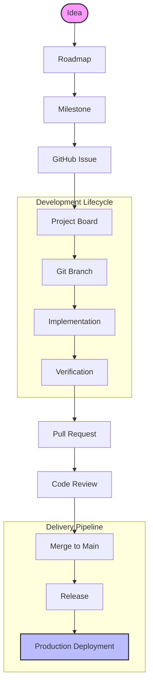

# Engineering Workflow

This document describes the engineering workflow followed in this repository. It defines how work is planned, implemented, reviewed, released, and maintained to ensure a consistent development process and high code quality.

---

# Engineering Principles

The project follows these core engineering principles:

- Single Responsibility Principle (SRP)
- Single Source of Truth (SSOT)
- Small, focused commits
- Small, reviewable pull requests
- Documentation evolves with the code
- Backward-compatible releases whenever possible
- Quality before merge
- Production-ready by default
- Continuous improvement

---

# Development Lifecycle

Every feature, bug fix, refactor, or documentation change follows the same lifecycle.



---

# Planning

## Roadmap

Large features are first planned in the project roadmap.

The roadmap represents the long-term direction of the project and is the source for future milestones.

---

## Milestones

Milestones group related work into a release.

Examples:

- v1.8.2 – Production Hardening
- v1.9.0 – Dashboard Analytics
- v1.10.0 – Budget Management

Each issue should belong to one milestone.

---

## GitHub Issues

Every significant change starts with a GitHub Issue.

An issue should include:

- Overview
- Objectives
- Scope
- Out of Scope
- Acceptance Criteria
- Labels
- Milestone

Issues are the source of truth for implementation work.

---

## GitHub Projects

Issues move through the project board.

Typical workflow:

```text
Backlog
    ↓
Ready
    ↓
In Progress
    ↓
Review
    ↓
Testing
    ↓
Done
```

---

# Branch Strategy

Branching follows Git Flow.

```text
main
│
├── develop
│     │
│     ├── feature/*
│     ├── fix/*
│     ├── refactor/*
│     ├── docs/*
│     └── chore/*
```

## Branch Naming

Examples:

```
feature/dashboard-analytics
feature/budget-management

fix/render-build

refactor/query-optimization

docs/engineering-workflow

chore/production-hardening
```

---

# Commit Convention

The project follows Conventional Commits.

Examples:

```
feat(auth): implement refresh tokens

fix(users): prevent duplicate registration

refactor(database): optimize transaction queries

docs(api): update authentication examples

test(auth): add login integration tests

chore(runtime): align runtime and CI configuration
```

Each commit should represent one logical objective.

---

# Scope Control

Before creating a commit:

- Review the complete scope.
- Ensure no additional related changes belong in the same objective.
- Complete implementation.
- Run verification.
- Commit only after the objective is complete.

Avoid amending commits because additional work was discovered later.

---

# Development Guidelines

During implementation:

- Keep controllers thin.
- Place business logic in services.
- Keep repositories responsible only for data access.
- Avoid duplicated logic.
- Prefer reusable abstractions.
- Follow existing project structure.
- Keep functions focused and easy to test.

---

# Documentation Policy

Documentation is treated as part of the codebase.

Documentation should be updated whenever:

- A feature is added
- Architecture changes
- Deployment changes
- Public APIs change
- Development workflow changes

Documentation should never become outdated.

---

# Verification Checklist

Before every commit, verify:

```bash
npm run lint

npm run typecheck

npm test

npm run coverage

npm run build
```

No commit should be created until all checks pass.

---

# Pull Requests

## Feature Pull Requests

```
feature/*
        ↓
develop
```

Feature PRs contain implementation details.

---

## Release Pull Requests

```
develop
      ↓
main
```

Release PRs summarize the entire release.

They should include:

- Overview
- Highlights
- Validation
- Breaking Changes
- Deployment Readiness

---

# Code Review Checklist

Before approving a Pull Request, verify:

- Scope is correct
- Naming is consistent
- Architecture is respected
- No unnecessary complexity
- No duplicated logic
- Tests pass
- Documentation updated
- Build succeeds

---

# Releases

Every release follows Semantic Versioning.

```
MAJOR.MINOR.PATCH
```

Examples:

```
1.8.0

1.8.1

1.9.0

2.0.0
```

Every release includes:

- Git Tag
- GitHub Release
- CHANGELOG update
- Deployment verification

---

# Definition of Done

A task is considered complete only when:

- Acceptance criteria are satisfied.
- Code review is complete.
- Lint passes.
- Type checking passes.
- Tests pass.
- Coverage reviewed (for release milestones)
- Production build succeeds.
- Documentation is updated.
- CHANGELOG is updated (if required).
- Pull Request is merged.
- Deployment is verified (when applicable).

---

# Repository Standards

The repository maintains the following standards:

- Clean Architecture
- Conventional Commits
- Semantic Versioning
- Git Flow
- Automated Testing
- Continuous Integration
- Professional Documentation
- Production-first mindset

---

# Continuous Improvement

Engineering workflows evolve over time.

Whenever better practices are adopted, this document should be updated so future contributors follow the same standards.

The goal is not only to build software, but also to continuously improve how the software is built.
